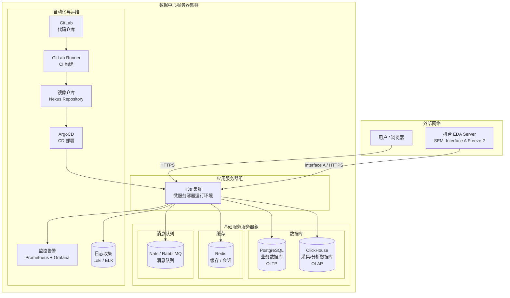

# 作者的官方博客

作者的官方博客地址： [https://dusi.dev](https://www.dusi.dev)


## Markdown样式内容

二级标题

### 标题

三级标题

---

## 代码块内容

HTML代码块

```html
<html>
    <head>
        <title>标题</title>
    </head>
    <body>
        <h1>标题</h1>
    </body>
</html>
```

CSS代码块

```css
body {
    background-color: #f0f0f0;
}
```

JavaScript代码块

```javascript
console.log('Hello World!');
```

Csharp代码块

```csharp
using System;

namespace MyBlog
{
    class Program
    {
        static void Main(string[] args)
        {
            Console.WriteLine("Hello from C#!");
        }
    }
}
```

## 列表内容

无序列表

- 无序列表1
- 无序列表2
- 无序列表3

有序列表

1. 有序列表1
2. 有序列表2
3. 有序列表3

## 表格内容

| 项目               | 价格      | 数量 | 说明                                 | 备注               |
| ------------------ | --------- | ---- | ------------------------------------ | ------------------ |
| iPhone max pro 111 | $560.0000 | 100000    | 说明内容有可以很长，超出了有限的宽度 | 仅备注说明测试内容 |
| iPad               | $780      | 2    | 留白                                 | 备注说明           |
| iMac               | $1999     | 1    | 留白                                 | 备注说明           |


### 图表




## 引用内容

> 这是普通的引用

> [!NOTE]
> Information the user should notice even if skimming

> [!IMPORTANT]
> Essential information required for user success

> [!WARNING]
> Dangerous certain consequences of an action
